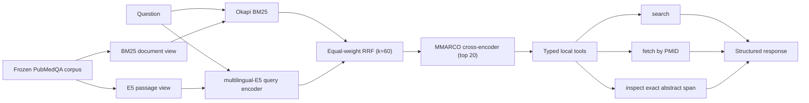

# Architecture

## Runtime path

The title-assisted v0.2 route indexes title plus abstract. The v0.3
abstract-only stress route creates a separate `AbstractPassage` type with no
title member and passes only its `abstract` string into BM25, E5, and the
cross-encoder. Tests record model inputs and fail if the title appears.

## Trust boundaries

- Runner inputs contain only `case_id` and question.
- Retrieval rankings are written and hash-frozen before target PMIDs are read.
- The answer baseline is trained only on the official non-test records.
- Typed tools have bounded call counts and record canonical input/output
  hashes, latency, status, and retry count.
- Citation spans are validated against the exact abstract offsets and hashes.
- Dataset, corpus, rankings, reports, and models are bound by SHA-256 and
  immutable baseline IDs.

## Why two diagnostics

The abstract-only test asks whether retrieval depends on the title-derived
question appearing verbatim in the indexed title. The evidence-utilization
controls ask whether the answerer's predictions change beneficially when
provided the correct abstract rather than no abstract or a wrong abstract.
These diagnose different failure surfaces and should not be merged into one
headline number.
