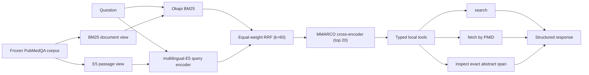
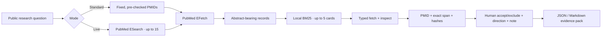

# Architecture

## Two intentionally separate runtime surfaces

BioEvidence Agent exposes an engineering evaluation pipeline and a local
product workflow. They share normalized PubMed records, BM25, typed evidence
tools, exact spans, and hashes; they do not share the same candidate discovery
or ranking stack.

| Property | Agent Engineering | Product Demo |
|---|---|---|
| Purpose | frozen public-benchmark diagnosis | human-in-the-loop evidence-pack workflow |
| Corpus/candidates | frozen 1,000-document PubMedQA corpus | fixed PMIDs or current PubMed ESearch results |
| Retrieval | BM25 + multilingual-E5 + equal-weight RRF + cross-encoder | EFetch + local BM25; live mode first uses ESearch |
| Direction/verdict | fixed benchmark answer baseline is measured | system always returns “unclear / needs human review” |
| Distribution | closed and public | open-world candidate discovery, not evaluated for recall |

## Agent Engineering path

The title-assisted v0.2 route indexes title plus abstract. The v0.3
abstract-only stress route creates a separate `AbstractPassage` type with no
title member and passes only its `abstract` string into BM25, E5, and the
cross-encoder. Tests record model inputs and fail if the title appears.

## Product Demo path

The product adapter imports the core PubMed, document, BM25, tool, and hashing
types. It deliberately does not load E5, RRF, the cross-encoder, or the weak
PubMedQA answerer. Standard mode stabilizes candidate identity but still
fetches current records; live mode relies on current PubMed ESearch ordering.

The wheel package contains only the core `src/bioevidence` CLI closure. The
web server, UI, and launcher live under `apps/product_demo/` and `scripts/`, so
the product path runs from a repository checkout.

## Trust boundaries

- Runner inputs contain only `case_id` and question.
- Retrieval rankings are written and hash-frozen before target PMIDs are read.
- The answer baseline is trained only on the official non-test records.
- Typed tools have bounded call counts and record canonical input/output
  hashes, latency, status, and retry count.
- Citation spans are validated against the exact abstract offsets and hashes.
- Dataset, corpus, rankings, reports, and models are bound by SHA-256 and
  immutable baseline IDs.
- Product events reject question, abstract, snippet, note, name, email, and
  phone text; evidence-pack downloads remain user-managed research data.
- The product system never promotes a related card to a scientific verdict;
  every card remains subject to human scope and source review.

## Why two diagnostics

The abstract-only test asks whether retrieval depends on the title-derived
question appearing verbatim in the indexed title. The evidence-utilization
controls ask whether the answerer's predictions change beneficially when
provided the correct abstract rather than no abstract or a wrong abstract.
These diagnose different failure surfaces and should not be merged into one
headline number.

## Scope-control layer

The product's deterministic
[scope controls](../reports/product_scope_controls_v1.md) operate only on
pre-declared metadata. They prevent a population, species, intervention,
endpoint, timepoint, context-only, or unknown-scope record from becoming a
candidate for decisive review. They do not extract those fields from article
text and do not perform scientific judgment. The separation is intentional:
the controls test a software invariant without turning a synthetic fixture
into a claim of biomedical NLI performance.
